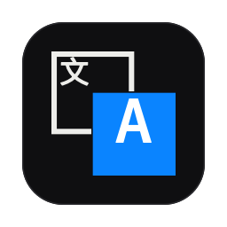
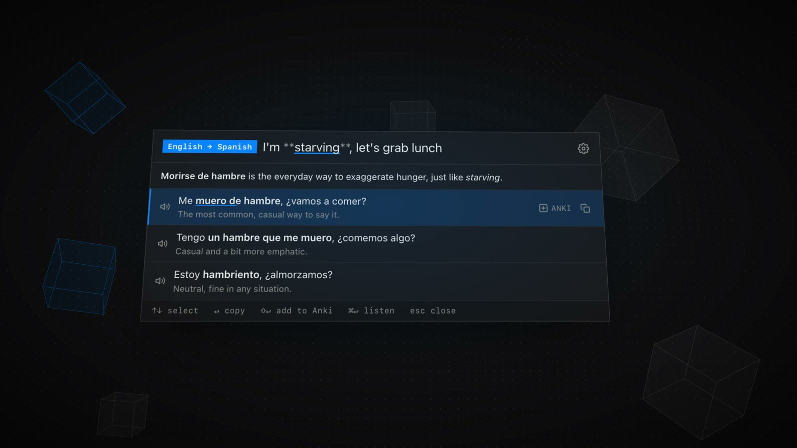

<div align="center">
    
</div>

# Quick Translate

A Spotlight-like launcher for learning a second language. Double-tap **⌘** to open it.

**Website:** [raphaelkieling.github.io/quick-translate](https://raphaelkieling.github.io/quick-translate/)

<a href="https://raphaelkieling.github.io/quick-translate/demo.mp4">
    
</a>

▶ [Watch the 20 s demo](https://raphaelkieling.github.io/quick-translate/demo.mp4)

- **Translate**: say it in your language, get natural ways to say it in the other.
- **Translate back**: paste something in the other language, get natural ways to say it in yours.
- **Explore**: type a word in the other language, see it used in example sentences, each with a simple translation.
- **Listen**: hear the answers in your second language read aloud by a macOS voice (pick one for each language in Settings). When translating back, **⌘↵** reads what you typed instead.
- The launcher opens in the mode and language you used last.
- **History**: your last answers show under the modes while nothing is typed. Click one (or ↓ to it and ↵) to see it again.
- **Cache**: asking the same thing again answers instantly, without calling the AI. Turn it off or clear it in Settings.
- **Real Time Mode** (optional, in Settings): finds the language you type in. Your main language translates to the second one, a second language translates back to yours.

Works with OpenAI, Claude or Gemini. Can send translations to Anki via [AnkiConnect](https://ankiweb.net/shared/info/2055492159), with the phrase read aloud on the card.

## Run

```sh
npm install
npm start
```

The demo video is drawn and scored in code: `node video/render.mjs` renders [video/scene.html](video/scene.html) with headless Chrome, synthesizes the soundtrack ([video/audio.mjs](video/audio.mjs)) and writes `docs/demo.mp4`. It needs Google Chrome and ffmpeg.

## Install

Download the latest zip from [Releases](https://github.com/raphaelkieling/quick-translate/releases) (a new one is built on every push to `main`), or build it yourself:

```sh
npm run build
osascript -e 'quit app "QuickTranslate"'   # a running copy keeps the old version
rm -rf /Applications/QuickTranslate.app    # mv can't replace an existing app
mv "dist/mac-arm64/QuickTranslate.app" /Applications/
open /Applications/QuickTranslate.app
```

On Intel Macs the folder is `dist/mac/`.

After each build, macOS sees a new app: turn **Accessibility** off and on again for QuickTranslate (see below), or the double ⌘ stops working.

## First launch

1. Allow **Accessibility** in System Settings → Privacy & Security (needed for the double ⌘).
2. Fill in Settings: languages, API key, provider.

Find it in the menu bar: a square with **文** behind a square with **A**. Click it to switch between your second languages.
